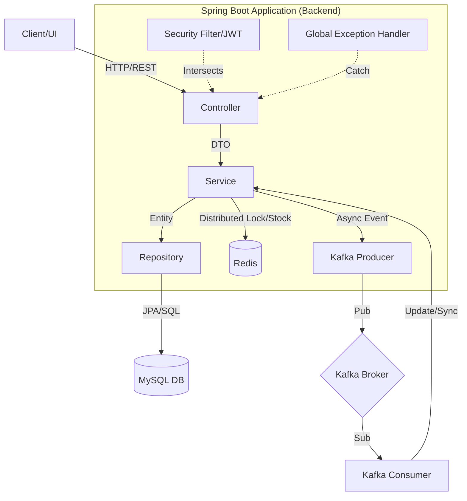

# 프로젝트 아키텍처 및 모듈 관계 통합 분석 보고서 (2026-04-06)

본 보고서는 프로젝트의 전체 아키텍처 구조, 디자인 패턴 적용 현황, 그리고 각 모듈(디렉토리)별 상세 구성 요소와 그들 간의 상호작용을 통합하여 분석한 결과입니다.

---
~
## 1. 아키텍처 개요 및 시스템 구조

이 프로젝트는 **계층형 아키텍처(Layered Architecture)**를 기반으로 하며, 고가용성과 동시성 처리를 위해 **이벤트 기반(Event-Driven)** 및 **분산 캐시/락(Distributed Cache/Lock)** 기술을 결합한 형태입니다.

### 전체 시스템 모듈 관계도 (Mermaid)

---

## 2. 디렉토리(모듈) 별 심층 분석 및 객체 관계

### 📂 config (Infrastructure & Connectivity)
- **역할**: 애플리케이션의 뼈대가 되는 인프라 설정을 관리하며, 외부 시스템과의 인터페이스를 정의합니다.
- **주요 Bean 및 역할**:
    - `RedisTemplate<String, String>`: 고속 재고 차감 및 멱등성 체크를 위한 레포지토리 역할을 수행합니다.
    - `KafkaTemplate<String, OrderEvent>`: 주문 생성 등의 이벤트를 비동기로 전파하기 위한 프로듀서 설정을 제공합니다.
    - `SecurityFilterChain`: HTTP 요청에 대한 보안 필터 체인을 구성하여 인증/인가를 강제합니다.
- **모듈 관계**: 모든 Service 계층에서 데이터 영속성 외의 유틸리티성 작업(캐싱, 메시징, 보안)을 위해 이 설정을 참조합니다.

### 📂 security (Authentication & Authorization)
- **역할**: 시스템의 접근 제어 및 사용자 식별을 담당합니다.
- **주요 Bean 및 알고리즘**:
    - `JwtTokenProvider`: **HMAC-SHA 알고리즘**을 사용하여 JWT를 생성하고 검증합니다. Access Token과 Refresh Token의 생명주기를 관리합니다.
    - `JwtAuthenticationFilter`: 요청 헤더의 `Authorization` 필드를 파싱하여 유효한 토큰인지 검사하는 **Interceptor** 역할을 수행합니다.
    - `UserDetailsServiceImpl`: DB(`UserRepository`)에서 사용자 정보를 조회하여 Spring Security의 `UserDetails` 객체로 변환합니다.
- **모듈 관계**: `Controller` 호출 전단계에서 작동하며, 인증 성공 시 `SecurityContextHolder`에 사용자 정보를 저장하여 `Service` 계층에서 `Authentication` 객체로 접근할 수 있게 합니다.

### 📂 service (Core Business Logic)
- **역할**: 도메인 객체와 인프라 서비스를 조합하여 비즈니스 유스케이스를 완성합니다.
- **핵심 알고리즘 및 로직**:
    - `OrderService (주문 처리 알고리즘)`:
        1. **Idempotency Check**: Redis의 `setIfAbsent`를 이용해 중복 요청을 10분간 차단합니다.
        2. **Distributed Lock**: `RedisLockService`를 통해 특정 `SaleEvent`에 대한 동시 접근을 제어합니다.
        3. **Redis-First Stock Control**: DB 부하를 줄이기 위해 Redis에서 먼저 `DECR` 연산으로 재고를 선점합니다. 실패 시 즉시 예외를 발생시켜 DB 트랜잭션을 방어합니다.
        4. **Transactional Outbox (지향)**: 현재는 주문 생성 후 바로 Kafka로 이벤트를 발행하나, 향후 안정성을 위해 Outbox 패턴 적용이 권장되는 지점입니다.
    - `RedisLockService (분산 락 알고리즘)`:
        - **Spin Lock 방식**: Redis의 `SET NX` 옵션을 활용하여 일정 시간(3초) 동안 100ms 간격으로 락 획득을 재시도합니다.
    - `FlashSaleService (재고 관리 및 동기화)`:
        - **Stock Sync Algorithm**: 주기적으로 또는 관리자 요청 시 `Order` 테이블의 합계와 Redis의 현재 재고를 비교하여 정합성을 맞춥니다.
- **모듈 관계**: `Controller`로부터 요청을 받아 `Repository`, `Redis`, `Kafka` 모듈을 조율(Orchestration)합니다.

### 📂 kafka (Asynchronous Messaging)
- **역할**: 서비스 간 결합도를 낮추고 후속 작업(알림, 통계, 결제 연동 등)을 비동기로 처리합니다.
- **주요 Bean 및 흐름**:
    - `OrderEventProducer`: 주문 성공 시 관련 데이터를 `ORDER_CREATED_TOPIC`으로 발행합니다.
    - `OrderEventConsumer`: 발행된 메시지를 수신하여 로그 기록 및 추가 비즈니스 로직(현재는 로깅 중심)을 수행합니다.
- **모듈 관계**: `OrderService`에서 트랜잭션의 마지막 단계로 호출되며, 시스템의 확장성을 담당합니다.

### 📂 repository & domain (Persistence Layer)
- **역할**: 데이터의 영구 저장 및 도메인 모델의 상태를 정의합니다.
- **주요 관계**:
    - **Cursor-based Pagination**: `ProductRepository` 및 `OrderRepository`에서 대량 데이터 조회를 위해 `Base64`로 인코딩된 커서를 활용한 고성능 페이징 알고리즘을 사용합니다.
    - **Soft Delete**: `Product` 엔티티는 삭제 시 실제 레코드를 지우지 않고 `is_deleted` 플래그를 통해 관리됩니다.
- **모듈 관계**: 서비스 계층의 핵심 데이터를 보관하며, JPA를 통해 객체와 RDB 간의 매핑을 수행합니다.

---

## 3. 모듈 간 상호작용 흐름도 (Sequence)

1. **Client** → `AuthController`: 로그인 후 JWT 획득
2. **Client** → `OrderController`: 주문 요청 (JWT + Idempotency Key 포함)
3. `Security Layer`: JWT 검증 및 사용자 식별
4. `OrderService`:
    - Redis에서 멱등성 검사 및 분산 락 획득
    - Redis 내 재고 차감 (성공 시 DB 트랜잭션 시작)
    - DB에 `Order` 저장 및 `SaleEvent` 예약 재고 업데이트
    - `OrderEventProducer`를 통해 Kafka 메시지 발행
5. `OrderEventConsumer`: 비동기로 주문 생성 이벤트 처리
6. **Client**: 응답 수신 (Pending 상태)

---

## 3. 적용된 주요 디자인 패턴 및 구현 평가

### 적용 패턴
- **Repository Pattern**: 데이터 액세스 계층의 표준화 및 추상화.
- **DTO Pattern**: 계층 간 격리 및 API 보안 강화.
- **Proxy Pattern**: `@Transactional`을 통한 선언적 트랜잭션 처리.
- **Facade Pattern**: `OrderService`에서 여러 도메인과 인프라 기능을 통합 제공.
- **Strategy Pattern**: `RedisLockService`에서 실행 로직을 `Supplier`로 전달받아 처리.
- **Builder Pattern**: 객체 생성의 가독성과 불변성 보장.
- **Observer/Pub-Sub**: Kafka를 통한 비동기 시스템 간 통신.

### 구현 완성도 평가
- **Java 21 & Spring Boot 3.5**: 최신 스택을 활용하여 `Virtual Threads` 등 향후 성능 확장에 유리한 구조입니다.
- **동시성 제어**: Redis 분산 락과 `idempotencyKey`를 이용한 멱등성 보장이 실무 수준으로 견고하게 구현되어 있습니다.

---

## 4. 개선 및 고도화 제안

### A. 분산 락 구현의 안정성 강화 (Redisson 도입)
- **현황**: `setIfAbsent` 기반의 직접 구현한 스핀 락 방식 사용.
- **제안**: **Redisson**을 도입하여 Pub/Sub 방식의 효율적인 락 대기와 만료 시간 자동 연장(Watchdog) 기능을 활용할 것을 권장합니다.

### B. 트랜잭션 일관성 보장 (Transactional Outbox 패턴)
- **현황**: 서비스 로직 내에서 DB 저장과 Kafka 메시지 발행이 순차적으로 발생.
- **제안**: **Outbox 테이블**을 활용하여 DB 트랜잭션과 메시지 발행의 원자성을 보장함으로써 데이터 유실을 방지해야 합니다.

### C. 도메인 중심 설계(DDD)로의 고도화
- **현황**: 서비스 계층에 로직이 집중된 빈약한 도메인 모델 구조.
- **제안**: 비즈니스 규칙과 상태 변경 로직을 엔티티 내부로 이동시켜 객체지향적인 설계를 강화할 필요가 있습니다.

### D. 락 범위 및 성능 최적화
- **현황**: 주문 생성 전체 과정이 하나의 큰 락 범위 내에 존재.
- **제안**: Redis의 원자적 연산(`DECR`)을 우선 활용하고, 물리적인 DB 예약 단계에서만 최소한의 락을 거는 방식으로 처리량을 높일 수 있습니다.

---

**분석 완료.** 본 프로젝트는 탄탄한 기본기 위에 분산 시스템의 핵심 기술들이 잘 녹아 있는 아키텍처를 가지고 있습니다.
